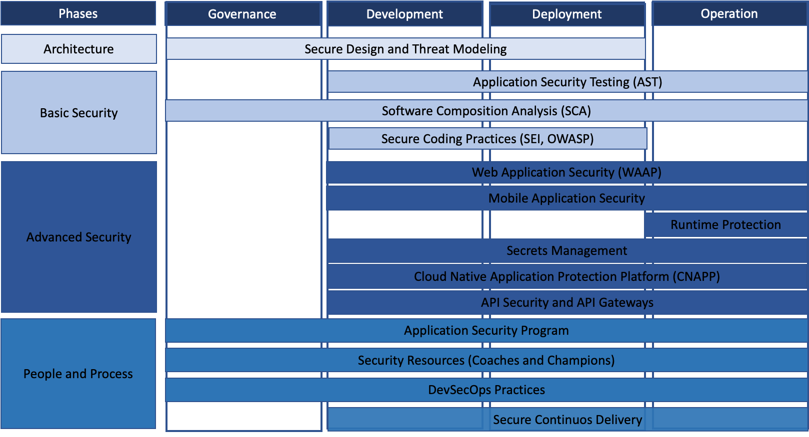

# Cyber Security Process Improvements

- [Overview](#overview)
  - [Scope](#scope)
- [Proposed Improvements](#proposed-improvements)
  - [Key Benefits](#key-benefits)
- [People and Process](#people-and-process)
  - [Solution](#solution)
  - [Pain Points](#pain-points)
- [Cloud Native Application Security Program](#cloud-native-application-security-program)
  - [Solution](#solution-1)
  - [Pain Points](#pain-points-1)

---

## Overview

Some efforts to implement security due diligence have been made, notably through the integration of security checks within the CI/CD pipeline. These include the deployment of a Static Application Security Testing (SAST) tool, SonarQube, a Dynamic Application Security Testing (DAST) tool, and OWASP ZAP (both tools from community and trial editions).

The approach to addressing the vulnerabilities identified by the current tools has been less than optimal. Identified issues are often deferred, only being addressed at the time of a new release rather than being resolved proactively during the earlier stages of development.

This delay in vulnerability resolution can be attributed to two primary factors:

1. Distinct lack of clear Security guidance from Indonesia's MOH/Gov and UNDP Indonesia, particularly in terms of defined Cybersecurity Policies, frameworks and Best Practices, which the development team could align with;
2. Noticeable gap in cybersecurity expertise within the BADR team, which is crucial for setting priorities and effectively managing security risks throughout the development process.

---

## Scope

The gap analysis and in-depth discussions with both Application Developers (BADR) and UNDP Indonesia have highlighted a critical issue prevalent in today's rapidly evolving development and deployment environments: cybersecurity is often an afterthought.

---

## Proposed Improvements

To address these challenges, Cybersecurity suggests the adoption of a structured approach that integrates people, processes and tools effectively. This approach aims to create a resilient and adaptive security posture capable of addressing the diverse challenges of modern Cloud Native Application Development and Deployment.

The proposed approach is built upon the following pillars:

1. Invest in Cybersecurity expertise (People)
2. Accelerate the implementation of DevSecOps best practices (Process)
3. Integrate automated Application security testing and techniques (Technology)
4. Embrace a Cloud Native Application Security Program

---

## Key Benefits

The main benefits of the suggested approach are the following:

- Streamlined Compliance and Governance
- Improved Risk Management
- Enhanced Collaboration and Scalability
- Comprehensive Security Coverage Across the SDLC
- Automation and Efficiency
- Adaptability to Evolving Threats

---

## People and Process

The first recommended improvement is to invest in cybersecurity expertise (People) and accelerate the implementation of DevSecOps best practices (Process). Together, these initiatives ensure security knowledge is distributed across teams (developers, operations, business) and seamlessly integrated into the SDLC.

### Solution

1. Establish a Cybersecurity Education and Training program (Cybersecurity Champions and Coaches):
   - Identify champions within development, operations, and business teams
   - Provide hands-on training in secure coding, threat modelling, DevSecOps and compliance standards
   - Empower cybersecurity champions to act as advocates for security practices within their respective teams

2. DevSecOps Implementation
   - Establish secure CI/CD pipelines with automated security checks at each stage (e.g., SAST, DAST, SCA, IaC Scanning)
   - Integrate policy-as-code frameworks to enforce compliance throughout the SDLC

### Pain Points

- Inconsistent Security Practices
- Higher Cost of Remediation
- Resistance to Security Processes
- Increased Risk of Security Breaches

---

## Cloud Native Application Security Program

The second improvement suggested is to embrace a Cloud Native Application Security Program. The program will address the unique security challenges posed by modern cloud-native architectures and deployments.

### Solution

Program pillars:

1. Security by Design
   - Integrating security into infrastructure, platform, and application design from the outset
   - Ensures that security is a foundational principle rather than a retroactive measure

2. Continuous Security Automation Scanning and Testing (DevSecOps Platform)
   - Deploy the DevSecOps platform to enforce automated scanning and testing throughout all SDLC and CI/CD pipeline stages
   - Trigger SAST, DAST, SCA, IaC Scanning, and secrets management to ensure continuous, proactive security

3. Continuous Runtime Protection (Advanced Security)
   - Implement tools and techniques to protect running workloads in the cloud, including clusters and containers
   - Real-time threat detection and mitigation to safeguard the runtime environment

### Pain Points

- Lack of awareness of the unique risks associated with cloud-native environment
- Manual Application Security Process, error-prone and difficult to scale
- Inadequate Runtime Protection and lack of dynamic security controls
